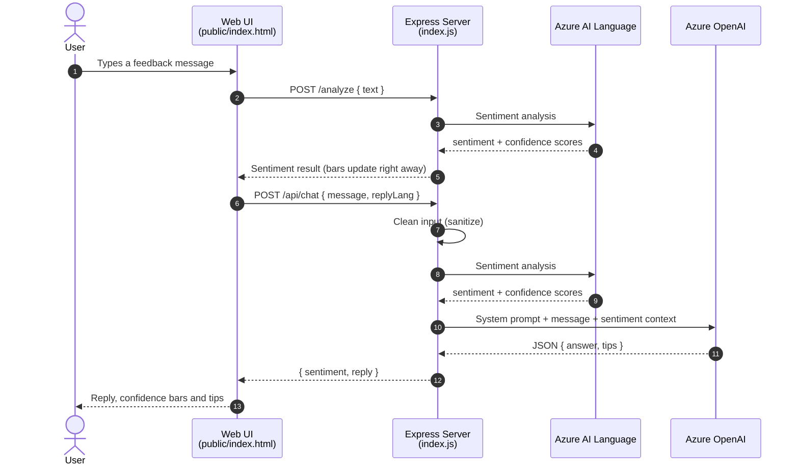

<div align="center">

# 🛡️ Secure Feedback Assistant

### An AI assistant that reads how a message *feels* before it answers.

I built this during my summer internship to learn how cloud AI services fit into a real, secure web application. You type a piece of feedback, the app measures its emotion as a percentage breakdown, and an AI model writes a reply that fits that emotion.


[How it works](#how-it-works) · [Design decisions](#design-decisions) · [Problems I solved](#problems-i-solved) · [Run it](#run-it-yourself)

</div>

---

<!--
  📸 Add a screenshot or short GIF of the app here — it's the first thing recruiters look at.
  Save it as docs/screenshot.png, then delete the arrows around the line below.
-->
<!--  -->

## 💬 Why I built it

When someone writes *"The app feels slow when loading my dashboard,"* the right reply depends on how frustrated they are. A cheerful, generic answer to an annoyed user makes things worse.

So I wanted an assistant that first **understands the tone** of a message and then **answers with that tone in mind**, and I wanted to build it the way a real company would: with the API keys protected and the service guarded against abuse.

## 👀 What it looks like in practice

> **User:** *"The app feels slow when loading my dashboard."*
>
> | Sentiment | Confidence |
> |---|---|
> | 🔴 Negative | `█████████████████░░░` **87%** |
> | 🟡 Neutral | `██░░░░░░░░░░░░░░░░░░` **10%** |
> | 🟢 Positive | `█░░░░░░░░░░░░░░░░░░░` **3%** |
>
> **Assistant:** *"Thanks for the feedback. Here are a few steps you can try to improve load time..."*
>
> 💡 **Tips:** Check your network · Update to the latest version · Clear cache

<sub>Illustrative example of the app's output format.</sub>

The screen is split in two: the conversation on the left, and on the right the latest sentiment label, a confidence bar for each emotion, and the assistant's tips. Replies can be in English or Turkish.

<a id="how-it-works"></a>

## ⚙️ How it works

The idea is simple: **measure the emotion first, then let the AI answer with that information.**

1. **The user sends a message** from the web page.
2. **My Express server cleans the input** and sends it to **Azure AI Language**, which returns a sentiment label and a confidence score for positive, neutral and negative.
3. **The server passes the message and that score to Azure OpenAI** (a `gpt-4o-mini` deployment), with a system prompt that asks for a JSON answer containing a reply and a list of tips.
4. **The page shows everything together:** the reply, the percentage bars and the tips.

The browser never talks to Azure directly. Only the server knows the keys.



<a id="design-decisions"></a>

## 🧭 Design decisions (and why I made them)

| Decision | Why |
|---|---|
| **Keep all API keys on the server** in a `.env` file | If keys were in the browser, anyone could open developer tools, copy them and use my Azure account |
| **Ask the model for strict JSON** (`answer` + `tips`) | Free-form text is hard to display reliably. With a fixed format the UI always knows where the answer and the tips are, and the server falls back safely if parsing ever fails |
| **Low temperature (0.2) and a 400-token limit** | Feedback replies should be consistent and short, and fewer tokens also means lower cost |
| **Rate limiting: 30 requests per minute per IP** | AI calls cost money, so one person shouldn't be able to flood the service |
| **Input cleaning before calling the model** | Strips code blocks and sensitive keywords and caps messages at 2,000 characters, which reduces simple prompt-injection attempts |
| **Security headers with `helmet` and a CORS allow-list** | Standard protections for an Express app. I turned off helmet's Content Security Policy because the page uses inline scripts |
| **Timeouts on every Azure call (15–20 s)** | If Azure is slow, the user gets an error instead of a page that hangs forever |

<a id="problems-i-solved"></a>

## 🧠 Problems I ran into and how I solved them

**"DeploymentNotFound" errors from Azure OpenAI.**
At first I pasted a full URL into the configuration. In Azure OpenAI you first *deploy* a model and then call it using the **resource endpoint plus the deployment name** you gave it. Once I understood the difference between a resource and a deployment and passed only the deployment name, the calls worked.

**Sentiment requests returning "resource not found".**
Older Text Analytics paths don't work anymore. Microsoft's official documentation showed that sentiment analysis now lives under the **Analyze Text** API, and switching to that route fixed it.

**API tests breaking on Windows.**
Testing with `curl` on Windows kept failing because of how the command line handles quotes in JSON. I switched to **Thunder Client** inside VS Code, saved my requests as a small collection, and used it to test positive, negative and timeout cases.

## 🔭 What I'd improve next

- [ ] **Analyze each message once.** Right now the page calls `/analyze` and then `/api/chat` analyzes the same message again, which is a duplicate Azure call
- [ ] **Detect the language automatically.** Sentiment analysis currently assumes Turkish input
- [ ] **Turn Content Security Policy back on** by moving the inline scripts into separate files, and send shorter error messages to the browser
- [ ] **Add automated tests** for the API routes
- [ ] **Deploy to Azure App Service** with the keys stored in Azure Key Vault

<a id="run-it-yourself"></a>

## 🚀 Run it yourself

**You'll need:** Node.js 18+ and an Azure subscription (Azure for Students works) with an **Azure AI Language** resource and an **Azure OpenAI** chat deployment such as `gpt-4o-mini`.

```bash
git clone https://github.com/gizemgokceisik/secure-feedback-assistant.git
cd secure-feedback-assistant
npm install

cp .env.example .env     # Windows: copy .env.example .env
                         # then add your own Azure endpoints and keys

npm start
```

Open **http://localhost:3000** and send your first message.

<details>
<summary><b>API reference</b></summary>

| Method | Route | Body | Returns |
|---|---|---|---|
| `GET` | `/health` | — | `Service is running` |
| `POST` | `/analyze` | `{ "text": "..." }` | `{ result }` — the raw Azure AI Language response |
| `POST` | `/api/chat` | `{ "message": "...", "replyLang": "en" \| "tr" }` | `{ sentiment, reply: { answer, tips } }` |

Example `/api/chat` response:

```json
{
  "sentiment": {
    "sentiment": "negative",
    "scores": { "positive": 0.03, "neutral": 0.10, "negative": 0.87 }
  },
  "reply": {
    "answer": "Thanks for the feedback. Here are a few steps you can try to improve load time...",
    "tips": ["Check your network", "Update to the latest version", "Clear cache"]
  }
}
```

</details>

## 🧰 Built with

**Backend** Node.js · Express 5 · Axios<br>
**AI** Azure AI Language · Azure OpenAI · Azure AI Foundry<br>
**Security** helmet · cors · express-rate-limit · dotenv<br>
**Frontend** HTML · CSS · vanilla JavaScript<br>
**Tooling** VS Code · Thunder Client

---

<div align="center">

Built by **Gizem Gökçe Işık** during a summer internship at **İndisol Bilişim ve Teknoloji Hizmetleri A.Ş. (OYAK Group)**, Aug – Sep 2025

[LinkedIn](https://linkedin.com/in/gizemgokceisik) · [GitHub](https://github.com/gizemgokceisik)

</div>
