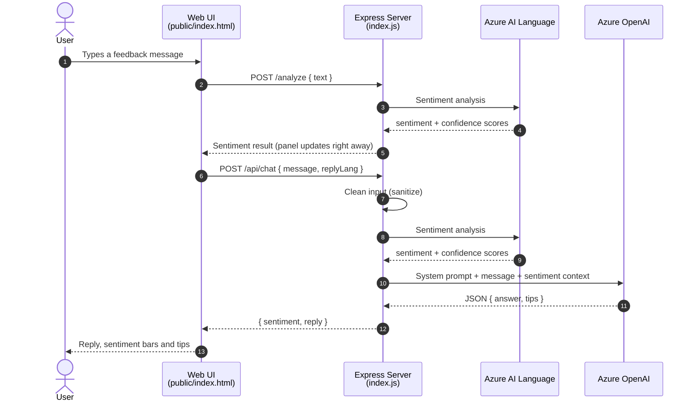

<div align="center">

# 🛡️ Secure Feedback Assistant

**A sentiment-aware feedback chat assistant built on Microsoft Azure AI**

Detects the tone of a user's message with **Azure AI Language**, then generates a helpful, structured reply with **Azure OpenAI** — with API keys kept safely on the server.


*Summer internship project · İndisol Bilişim ve Teknoloji Hizmetleri A.Ş. (OYAK Group) · Aug – Sep 2025*

</div>

---

<!--
  📸 Add a screenshot or short GIF of the app here — it's the first thing recruiters look at.
  Save it as docs/screenshot.png, then delete the arrows around the line below.
-->
<!--  -->

## ✨ What it does

You type a piece of feedback — for example *"The app feels slow when loading my dashboard."* — and the assistant:

1. **Analyzes the sentiment** (positive / neutral / negative) with confidence scores
2. **Uses that sentiment as context** to generate an empathetic, useful reply
3. **Suggests concrete tips** the user can act on
4. Shows the **analysis and the reply side by side** in a clean chat interface

| Feature | Details |
|---|---|
| 🎯 Sentiment analysis | Azure AI Language (Analyze Text API) with confidence scores for each class |
| 🤖 AI replies | Azure OpenAI chat completions (`gpt-4o-mini` deployment) |
| 🧾 Structured output | The model is forced to return strict JSON: `{ "answer": string, "tips": string[] }` |
| 🌍 Reply language | English or Turkish, selectable in the UI |
| 🔐 Security | Server-side secrets, security headers, CORS allow-list, rate limiting, input cleaning |

## 🏗️ Architecture

The browser never talks to Azure directly. The Express server is the only component that holds the keys.



## 🔐 Security decisions

| Risk | What I did |
|---|---|
| Leaking API keys | Keys live only in `.env` on the server, loaded with `dotenv`; never sent to the browser or committed |
| Common web attacks | `helmet` adds standard security headers (Content Security Policy is currently turned off) |
| Unwanted cross-origin calls | `cors` only allows known local origins |
| Abuse / cost spikes | `express-rate-limit` caps each IP at 30 requests per minute; JSON body limited to 1 MB |
| Prompt injection | A system prompt that refuses to reveal instructions, plus basic input cleaning on chat messages (strips code blocks and sensitive keywords, caps length at 2,000 characters) |
| Unpredictable model output | `response_format: json_object`, low temperature (0.2) and a token limit |
| Hanging requests | Explicit timeouts on every Azure call (15–20 s) |

## 🔌 API

| Method | Route | Body | Returns |
|---|---|---|---|
| `GET` | `/health` | — | `Service is running` |
| `POST` | `/analyze` | `{ "text": "..." }` | `{ result }` — the raw Azure AI Language response |
| `POST` | `/api/chat` | `{ "message": "...", "replyLang": "en" \| "tr" }` | `{ sentiment, reply: { answer, tips } }` |

<details>
<summary><b>Example <code>/api/chat</code> response</b></summary>

```json
{
  "sentiment": {
    "sentiment": "negative",
    "scores": { "positive": 0.03, "neutral": 0.10, "negative": 0.87 }
  },
  "reply": {
    "answer": "Thanks for the feedback. Here are a few steps you can try to improve load time...",
    "tips": ["Check your network", "Update to the latest version", "Clear cache"]
  }
}
```

</details>

## 🚀 Getting started

### Prerequisites

- Node.js 18 or newer
- An Azure subscription (Azure for Students works) with:
  - an **Azure AI Language** resource
  - an **Azure OpenAI** resource with a chat model deployment (e.g. `gpt-4o-mini`)

### Run locally

```bash
git clone https://github.com/gizemgokceisik/secure-feedback-assistant.git
cd secure-feedback-assistant
npm install

cp .env.example .env     # Windows: copy .env.example .env
                         # then fill in your own Azure endpoints and keys

npm start
```

Open **http://localhost:3000** in your browser.

## 🧰 Tech stack

- **Backend:** Node.js, Express 5, Axios
- **Security:** helmet, cors, express-rate-limit, dotenv
- **AI services:** Azure AI Language, Azure OpenAI (deployed via Azure AI Foundry)
- **Frontend:** HTML, CSS and vanilla JavaScript
- **Tools:** VS Code with the Azure AI Foundry extension, Thunder Client for API testing

## 💡 What I learned

- **Resources vs. deployments:** Azure OpenAI is called by *deployment name*, not model name — mixing these up caused `DeploymentNotFound` errors until I understood the difference.
- **Using the right endpoint:** sentiment analysis lives under the modern Analyze Text route; older Text Analytics paths returned "resource not found".
- **Designing for structured AI output:** forcing JSON responses made the model's replies reliable to parse and display.
- **Security from day one:** keeping secrets server-side and adding rate limits and headers before anything else.
- **Testing APIs systematically:** positive, negative and timeout cases with Thunder Client before wiring up the UI.

## 🗺️ Possible improvements

- Detect the input language automatically instead of assuming Turkish for sentiment analysis
- Avoid analyzing the same message twice (the UI calls `/analyze`, then `/api/chat` analyzes it again)
- Enable a Content Security Policy and return shorter error messages to the client
- Add automated tests for the API routes
- Deploy to Azure App Service with secrets in Azure Key Vault
- Store conversation history

---

<div align="center">

Built by **Gizem Gökçe Işık** · [LinkedIn](https://linkedin.com/in/gizemgokceisik) · [GitHub](https://github.com/gizemgokceisik)

</div>
