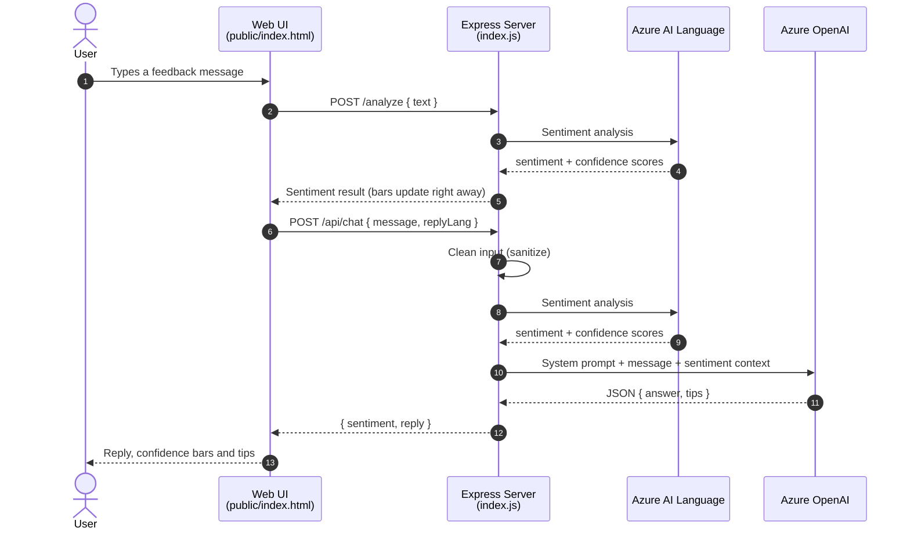

<div align="center">

# 🛡️ Secure Feedback Assistant

### Understand how your users *feel* — and answer them the right way.

An AI assistant that reads the emotion behind every piece of feedback, shows it as a clear percentage breakdown, and replies with an empathetic answer and actionable tips. Powered by **Azure AI Language** and **Azure OpenAI**, with every API key locked safely on the server.


[How it works](#how-it-works) · [Security](#security) · [Quickstart](#quickstart) · [API](#api-reference)

</div>

---

<!--
  📸 Add a screenshot or short GIF of the app here — it's the first thing recruiters look at.
  Save it as docs/screenshot.png, then delete the arrows around the line below.
-->
<!--  -->

## 💬 The problem

Feedback arrives as plain text. A frustrated user and a mildly curious one can write almost the same sentence, and a generic reply to the first one makes things worse. Teams need to know **how** someone feels before deciding **what** to say.

## ✅ The solution

Secure Feedback Assistant turns every message into two things at once: **a measurable emotion reading** and **a reply shaped by that emotion**.

> **User:** *"The app feels slow when loading my dashboard."*
>
> | Sentiment | Confidence |
> |---|---|
> | 🔴 Negative | `█████████████████░░░` **87%** |
> | 🟡 Neutral | `██░░░░░░░░░░░░░░░░░░` **10%** |
> | 🟢 Positive | `█░░░░░░░░░░░░░░░░░░░` **3%** |
>
> **Assistant:** *"Thanks for the feedback. Here are a few steps you can try to improve load time..."*
>
> 💡 **Tips:** Check your network · Update to the latest version · Clear cache

<sub>Example output from the project's test runs.</sub>

## ✨ Highlights

| | |
|---|---|
| 📊 **Emotion you can measure** | Every message gets a positive / neutral / negative label plus a confidence percentage for each, shown as live bars in the UI |
| 🤖 **Replies that match the mood** | The sentiment result is passed to the language model as context, so the answer fits how the user actually feels |
| 💡 **Actionable, not generic** | Each reply comes with concrete tips displayed in their own panel |
| 🧾 **Predictable AI output** | The model must answer in strict JSON (`answer` + `tips`), so the app never breaks on a messy response |
| 🌍 **Bilingual replies** | Users choose English or Turkish replies with one click |
| 🔐 **Secure by default** | Keys never leave the server; rate limiting, security headers and input cleaning are built in |

<a id="how-it-works"></a>

## ⚙️ How it works

**1. Read the emotion →** Azure AI Language scores the message.<br>
**2. Shape the reply →** Azure OpenAI (`gpt-4o-mini`) writes an answer using that score as context.<br>
**3. Show both →** The UI displays the reply, the confidence bars and the tips side by side.

The browser never talks to Azure directly. The Express server is the only component that holds the keys.



<a id="security"></a>

## 🔐 Secure by design

Security was part of the first commit, not an afterthought.

| Threat | Protection |
|---|---|
| 🔑 Leaked API keys | Keys live only in a server-side `.env` file, never in the browser or the repository |
| 🌐 Common web attacks | `helmet` security headers (Content Security Policy currently turned off) |
| 🚪 Unwanted cross-origin calls | `cors` allow-list for known origins only |
| 💸 Abuse and cost spikes | Max **30 requests per minute** per IP, request body capped at **1 MB** |
| 🧨 Prompt injection | Hardened system prompt, plus chat input cleaning that strips code blocks and sensitive keywords and caps length at **2,000 characters** |
| 🎲 Unpredictable AI output | JSON-only responses, low temperature (**0.2**) and a token limit |
| ⏳ Hanging requests | Explicit **15–20 s** timeouts on every Azure call |

## 🧠 Engineering challenges solved

| Challenge | Solution |
|---|---|
| Calls to the chat model failed with `DeploymentNotFound` | Azure OpenAI is addressed by **deployment name**, not model name; restructured the configuration around that |
| Sentiment requests returned "resource not found" | Moved from legacy Text Analytics paths to the current **Analyze Text** API |
| Model replies were hard to parse reliably | Enforced a **JSON response format** with a fixed schema |
| Command-line API tests kept breaking on Windows quoting | Switched to **Thunder Client** for repeatable positive, negative and timeout tests |

<a id="quickstart"></a>

## 🚀 Quickstart

**You'll need:** Node.js 18+ and an Azure subscription (Azure for Students works) with an **Azure AI Language** resource and an **Azure OpenAI** chat deployment such as `gpt-4o-mini`.

```bash
git clone https://github.com/gizemgokceisik/secure-feedback-assistant.git
cd secure-feedback-assistant
npm install

cp .env.example .env     # Windows: copy .env.example .env
                         # then add your own Azure endpoints and keys

npm start
```

Open **http://localhost:3000** and send your first message.

<a id="api-reference"></a>

## 🔌 API reference

| Method | Route | Body | Returns |
|---|---|---|---|
| `GET` | `/health` | — | `Service is running` |
| `POST` | `/analyze` | `{ "text": "..." }` | `{ result }` — the raw Azure AI Language response |
| `POST` | `/api/chat` | `{ "message": "...", "replyLang": "en" \| "tr" }` | `{ sentiment, reply: { answer, tips } }` |

<details>
<summary><b>Example <code>/api/chat</code> response</b></summary>

```json
{
  "sentiment": {
    "sentiment": "negative",
    "scores": { "positive": 0.03, "neutral": 0.10, "negative": 0.87 }
  },
  "reply": {
    "answer": "Thanks for the feedback. Here are a few steps you can try to improve load time...",
    "tips": ["Check your network", "Update to the latest version", "Clear cache"]
  }
}
```

</details>

## 🧰 Tech stack

**Backend** Node.js · Express 5 · Axios<br>
**AI** Azure AI Language · Azure OpenAI · Azure AI Foundry<br>
**Security** helmet · cors · express-rate-limit · dotenv<br>
**Frontend** HTML · CSS · vanilla JavaScript<br>
**Tooling** VS Code · Thunder Client

## 🗺️ Roadmap

- [ ] Detect the input language automatically (sentiment currently assumes Turkish)
- [ ] Analyze each message once instead of twice
- [ ] Enable a Content Security Policy and shorter client-facing error messages
- [ ] Automated tests for the API routes
- [ ] Deploy to Azure App Service with secrets in Azure Key Vault
- [ ] Conversation history

---

<div align="center">

Built by **Gizem Gökçe Işık** during a summer internship at **İndisol Bilişim ve Teknoloji Hizmetleri A.Ş. (OYAK Group)**, Aug – Sep 2025

[LinkedIn](https://linkedin.com/in/gizemgokceisik) · [GitHub](https://github.com/gizemgokceisik)

</div>
